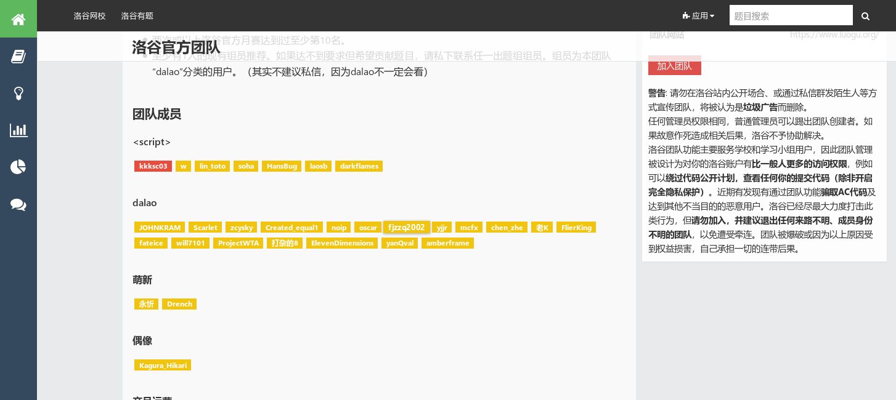
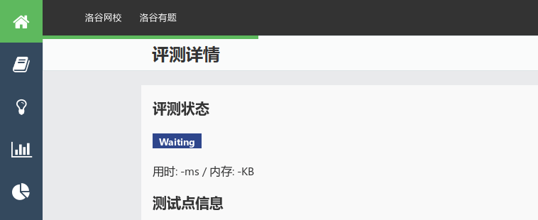

# 洛谷细节优化

 - 能让标题栏和你的网站内容对齐
 - 除了更方，还能更方
 - 去边框与扁平化处理
 - 部分card/jmnode的动画缩放、指针
 - 进度条小动画
 - **欢迎反馈**

### How to use: 
 - [Stylish](https://userstyles.org/styles/165677)

Recommend to use with **Luogu Square Theme** [@memset0](https://github.com/memset0) (Avalible on [Github](https://github.com/memset0/luogu-square) and [Stylish](https://userstyles.org/styles/164778/theme) ).
