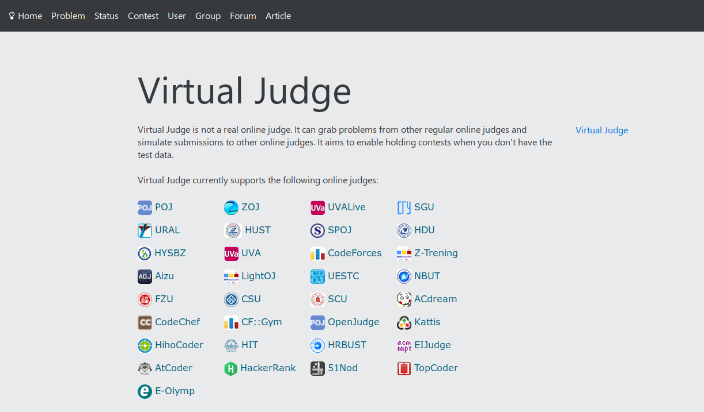
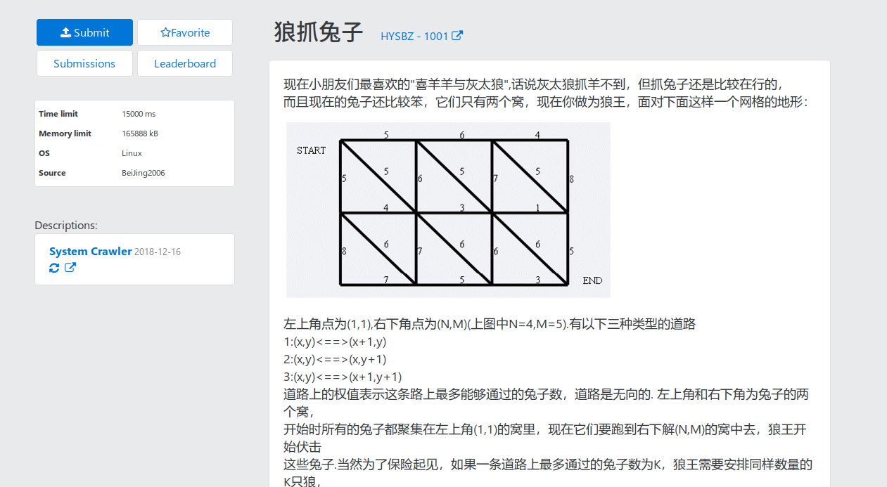
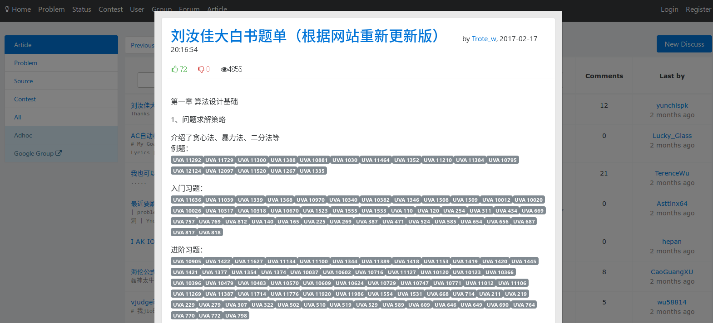
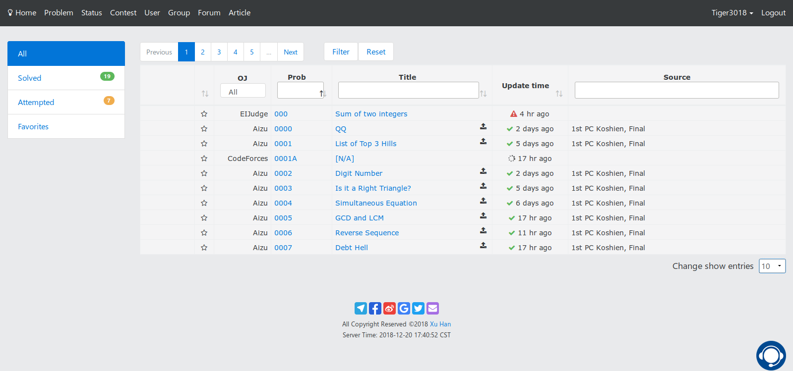

# 更实用的 Vjudge 主题

 - 契合方正屏幕的方正标题栏，外加酷炫醒目配色
 - 题目显示更加舒适
 - 动画显示更加舒适
 - 按钮的调色稍作调整
 - _暂未关注小组的配色_
 - **欢迎反馈**

### How to use: 
 - [Stylish](https://userstyles.org/styles/165677)

### Modify:
你可以自定义在网站标题栏显示的图标，只要是旧版本font-aweasome中有的都可以，格式形如
``\f0eb``。

### ScreenShot: 

